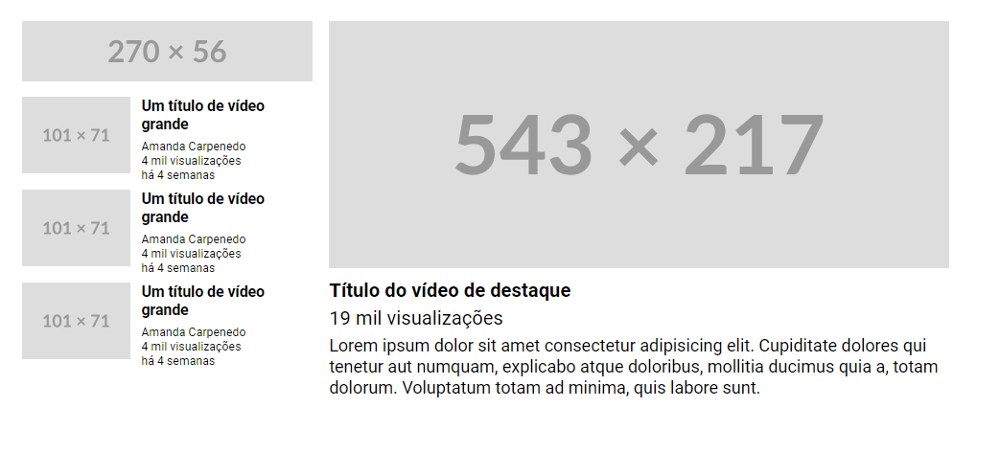

# Frontend Mentor - Advice generator app solution

Esta é a resolução do exercício proposto pelo curso Dev Quest. 
## Tabela de conteúdos

  - [O desafio](#O-desafio)
  - [Screenshot](#screenshot)
  - [Meu processo](#meu-processo)
  - [Construído com](#construído-com)
  - [O que eu aprendi](#o-que-eu-aprendi)
  - [Recursos úteis](#recursos-úteis)

### O desafio

O exercício é baseado na construção de um layout YouTube utilizando grid e flex. No presente arquivo o exercicio foi feito com o layout virado, pois queria praticar os conceitos aprendidos e fazê-los um pouco diferente da proposta original. Neste exercício foi utilizado apenas o HTML e o CSS. 

### Screenshot

## Meu processo

Primeiramente analisei a  imagem estática fornecida pelo desafio, marcando com retângulos coloridos cada parte a ser escrita em HTML e procurando localizar o que fazia parte do grid (linhas e colunas). A seguir, escrevi a marcação no HTML e estilizei cada classe utilizando o CSS. 
O display flex foi utilizado apenas na coluna onde temos os vídeos selecionados. Nas demais utilizei estilização simples nas < div>.

### Construído com

- Marcações semânticas em HTML5
- CSS propriedades de estilo
- Grid
- Flexbox
- CSS

### O que eu aprendi

Neste exercício aprendi como funciona o Grid, como utilizá-lo para delimitar seções e também como pensar na utillização das < div> para cada parte.

